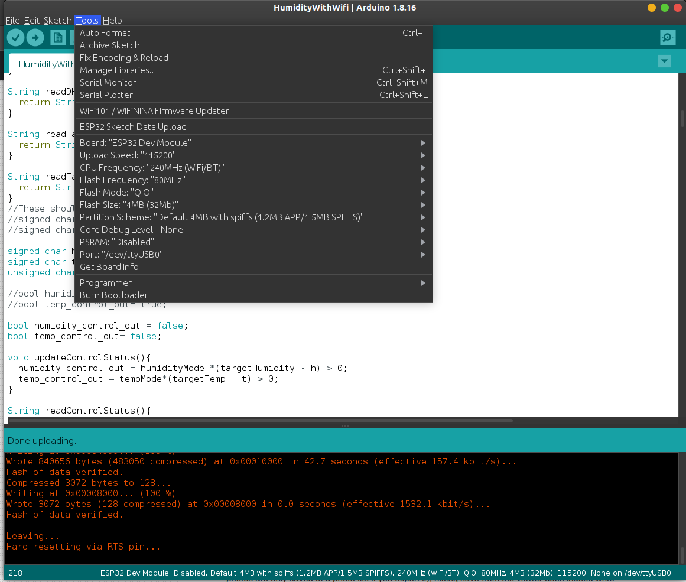
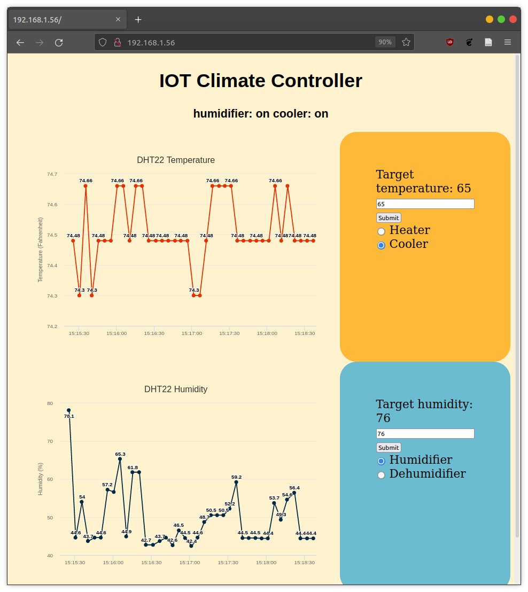

# ESP32-Humidstat

## Building

This project uses the ardunio ide for compiling and uploading. 

- If not already installed, you will need to install the Arduino IDE. If you're on Ubuntu, Canonical has good instructions [here](https://ubuntu.com/tutorials/install-the-arduino-ide#1-overview)

- After installing the IDE, we need to install the ESP32 board. In the Arduino IDE, go to file -> preferences. Near the bottom there should be a "Additional Boards Manager URLS:" field. Add the following url: `https://raw.githubusercontent.com/espressif/arduino-esp32/gh-pages/package_esp32_index.json`. Additional boards can be added by separating each url with a comma.

- Now exit preferences and go to Toos -> Boards -> Boards Manager. Search for esp32 and install **ESP32 by Espressif Systems**. After installation is complete, you should be able to select the **ESP32 Dev Module** in the Tools -> Boards menu. 

- This project uses the SPIFFS file system in order to save user settings between reboots. You should follow the instructions [here](https://randomnerdtutorials.com/install-esp32-filesystem-uploader-arduino-ide/) to install the ESP32 filesystem uploader. 

- In the tools dropdown make sure the Upload Speed is set to "115200".

Your tools dropdown menu should look like this (your port may be different):
 

- Before compiling, you will need to install the **DHT sensor library** by Adafruit in tools -> Manage Libraries. If prompted to install missing dependencies, select "Install All".

- Additionally, you will need to install: the [AsyncTCP Library](https://github.com/me-no-dev/AsyncTCP) and the [ESPAsyncWebServer Library](https://github.com/me-no-dev/ESPAsyncWebServer). To install these libraries, simply download as a zip from github, unzip the folder, and the place the folder in your Arduino/libraries folder as shown below. 

- That should be everything we need for our project to compile and upload. If you have any questions, let me know on github. 

- With our board connected, we will first upload our default file system using tools -> **ESP32 Sketch Data Upload**. 

- Now we compile and upload in one step by pressing the upload arrow button in the top left corner (below the file and edit tabs). Once the upload is complete, the board should automatically start in hotspot mode. we will be able to monitor the board's output in the arduino serial monitor. In the monitor, ensure the baud rate is set to 115200.

## Usage

- The board should initial start in hotspot mode (as indicated by the blinking yellow light). If the green light is blinking but you are unable to connect, hold down the big blue button for 3 seconds and the board should enter hotspot mode. To set the board's wifi network, connect to the board's local network "IOTClimateController" from another device and go to `192.168.1.1` in your browser. There you should be able to save your wifi network credentials. 

- Upon successful connection, the board's green light should now slowly flash.

- Once the board connects to your wifi network, go to `192.168.1.56` in your browser on any device on the same network. You should now be able to see the current temperature and humidity readings as well as set the desired temperature and humidity.

## The board

- Wiring documentation is to come... 

Devices used:

- [ESP32](https://www.amazon.com/gp/product/B0718T232Z/ref=ppx_yo_dt_b_search_asin_title?ie=UTF8&psc=1)
- [DHT22 with built in pull up resistor](https://www.amazon.com/gp/product/B073F472JL/ref=ppx_yo_dt_b_search_asin_image?ie=UTF8&psc=1)
- [HV Relay](https://www.amazon.com/gp/product/B00WV7GMA2/ref=ppx_yo_dt_b_search_asin_title?ie=UTF8&psc=1) 